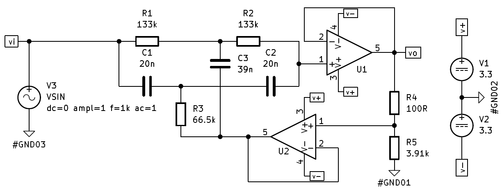

# MYo_BoARD
---

Projeto de uma placa de aquisição de sinais biomédicos  de 3 canais desenvolvida na disciplina de Projeto Integrador III do curso de Engenharia Elétrica do IFSC-Itajaí.

---
## Sumário

- [MYo\_BoARD](#myo_board)
  - [Sumário](#sumário)
  - [Introdução](#introdução)
    - [Os biossinais](#os-biossinais)
    - [Fluxograma do sistema](#fluxograma-do-sistema)
  - [Ensaio de frequência nos amplificadores - *AC Sweep*](#ensaio-de-frequência-nos-amplificadores---ac-sweep)
  - [Projeto do circuito de aquisição](#projeto-do-circuito-de-aquisição)
    - [Filtro Notch](#filtro-notch)
    - [Pré-amplificação](#pré-amplificação)
    - [Filtro passa-baixas](#filtro-passa-baixas)

---
## Introdução
### Os biossinais

Os biossinais são manifestações elétricas geradas pela atividade fisiológica dos tecidos e órgãos do corpo humano. Entre os mais estudados e aplicados em sistemas de aquisição e análise estão o eletroencefalograma (EEG), o eletrocardiograma (ECG) e o eletromiograma (EMG). Esses sinais carregam informações valiosas sobre o funcionamento do sistema nervoso, do coração e dos músculos esqueléticos, sendo amplamente utilizados em diagnósticos médicos, controle de próteses, interfaces cérebro-máquina e em pesquisas na área biomédica.

O sinal de EEG reflete a atividade elétrica cerebral, caracterizado por amplitudes muito baixas (na ordem de microvolts) e frequências relativamente baixas (até cerca de 100 Hz). Devido à sua suscetibilidade a ruídos e interferências, sua captação exige alto grau de amplificação e filtragem. É amplamente utilizado em estudos de sono, epilepsia e monitoramento do estado cognitivo.

Já o ECG registra a atividade elétrica do coração durante o ciclo cardíaco. Suas amplitudes são mais elevadas do que as do EEG e suas frequências se concentram nas faixas de até 150 Hz. O ECG é essencial no diagnóstico de arritmias, infartos e outras condições cardíacas, sendo um dos exames biomédicos mais comuns.

O EMG, por sua vez, capta a atividade elétrica dos músculos esqueléticos, resultante da ativação das fibras musculares pelo sistema nervoso. O sinal mioelétrico é caracterizado por amplitudes maiores (até milivolts) e uma banda de frequência que pode variar entre 20 Hz e 5000 Hz, dependendo do tipo de contração muscular e do músculo analisado. Este sinal é de particular interesse em aplicações de reabilitação, controle de próteses ativas e em sistemas de interação homem-máquina.

<table>
<thead>
  <tr>
    <th style="text-align:center">Biossinal</th>
    <th style="text-align:center">Faixa de Frequência (Hz)</th>
    <th style="text-align:center">Amplitude Típica</th>
  </tr>
</thead>
<tbody>
  <tr>
    <td style="text-align:center">EEG</td>
    <td style="text-align:center">0,5 – 100</td>
    <td style="text-align:center">10 – 100 µV</td>
  </tr>
  <tr>
    <td style="text-align:center">ECG</td>
    <td style="text-align:center">0,05 – 150</td>
    <td style="text-align:center">0,5 – 4 mV</td>
  </tr>
  <tr>
    <td style="text-align:center">EMG</td>
    <td style="text-align:center">20 – 5000 (típico até 500)</td>
    <td style="text-align:center">50 µV – 5 mV</td>
  </tr>
</tbody>
</table>

### Fluxograma do sistema

O sistema foi desenvolvido conforme o fluxograma a seguir.

|   |
|:--:|

## Ensaio de frequência nos amplificadores - *AC Sweep*

A fim de verificar a resposta em frequência dos amplificadores de instrumentação, realizou-se um ensaio que consiste em variar a frequência do sinal de entrada e medir o sinal na saída do amplificador. Dessa maneira, é possível obter um gráfico que descreve a variação do ganho em função do aumento da frequência a partir dos valores de entrada e saída medidos. O circuito para ensaio dos amplificadores foram montados conforme recomendação do <em>datasheet</em> de cada um deles e consta na Figura 1. A resposta de cada amplificador consta na Figura 2. Os equipamentos utilizados para esse ensaio foram: osciloscópio digital e gerador de funções, ambos disponibilizados pelo <em>campus</em>.

|  <em>Figura 1 – Circuito AC Sweep</em> |
|:--:|

|  <em>Figura 2 – Resposta em frequência dos amplificadores</em> |
|:--:|

## Projeto do circuito de aquisição
### Filtro Notch

O primeiro estágio do circuito consiste em um filtro que remova sinais de frequência de 60 Hz a fim de evitar interferências ruidosas oriundas da rede. Para tal filtro, utilizou-se a topologia Duplo-T, a qual permite selecionar a frequência central e fator de qualidade de forma independente. O circuito obtido e a sua respectiva resposta constam nas Figuras 3 e 4, respectivamente. A Figura 5 mostra a resposta do circuito já montado e testado em bancada.

|  <em>Figura 3 – Circuito do Filtro Notch</em> |
|:--:|

|  <em>Figura 4 – Resposta em frequência do filtro Notch (Simulado)</em> |
|:--:|

|  <em>Figura 5 – Resposta em frequência do filtro Notch (Real)</em> |
|:--:|

### Pré-amplificação

O segundo estágio consiste em um amplificador de instrumentação que mitiga o ruído de modo comum do sinal diferencial. Portanto, o ganho nesse estágio pode ser mais baixo, optando-se, então, por dar um maior ganho em estágios posteriores. Devido a banda de passagem do AD623AN ser mais linear que a do INA128P, optou-se por utilizá-lo no circuito dessa etapa. O circuito utilizado nessa etapa é o mesmo da Figura 1, o qual é o recomendado pelo fabricante no <em>datasheet</em>

### Filtro passa-baixas

O terceiro estágio consiste em um filtro passa-baixas de segunda ordem, topologia Sallen-Key. Esse filtro possui frequência de corte em 1 kHz. O circuito utilizado foi o da Figura 6. A Figura 7 Mostra a resposta em frequência obtida para o circuito em simulação.

|  <em>Figura 6 – Circuito do filtro passa-baixas</em> |
|:--:|

|  <em>Figura 7 – Resposta em frequência do filtro Passa-baixas (Simulado)</em> |
|:--:|