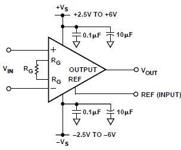
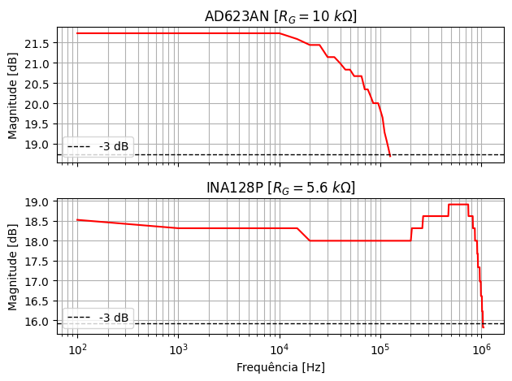
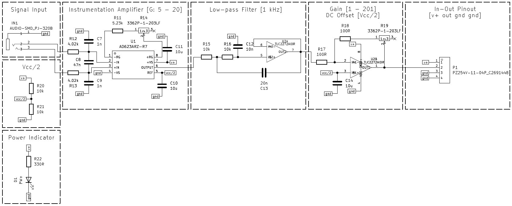
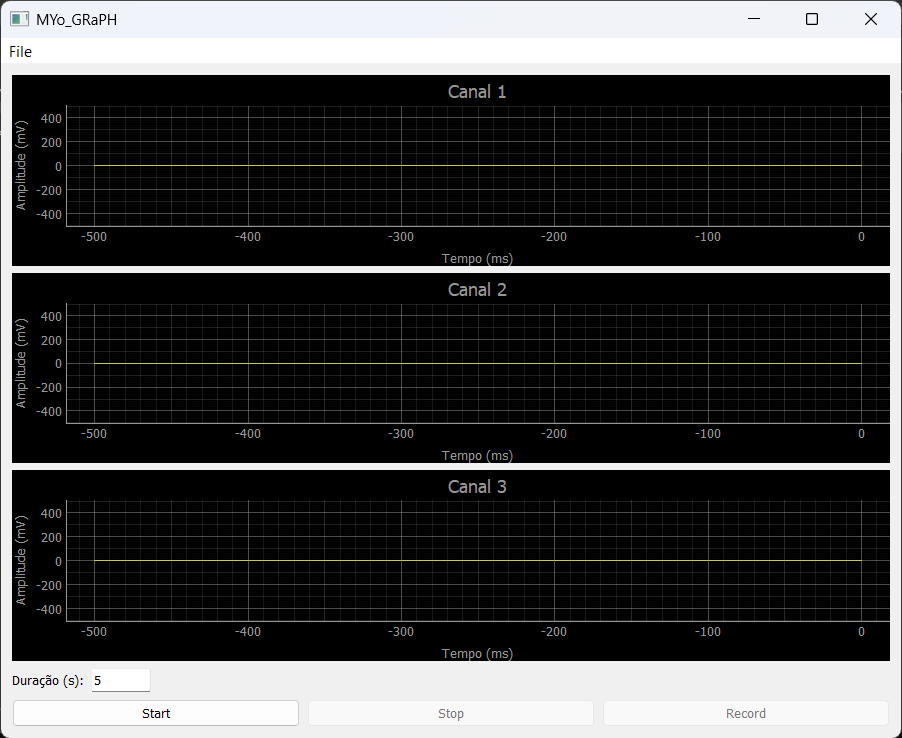

# MYo_BoARD
---

Projeto de uma placa de aquisição de sinais biomédicos  de 3 canais desenvolvida na disciplina de Projeto Integrador III do curso de Engenharia Elétrica do IFSC-Itajaí.

---
## Sumário

- [MYo\_BoARD](#myo_board)
  - [Sumário](#sumário)
  - [Introdução](#introdução)
    - [Os biossinais](#os-biossinais)
    - [Fluxograma do sistema](#fluxograma-do-sistema)
  - [Ensaio de frequência nos amplificadores - *AC Sweep*](#ensaio-de-frequência-nos-amplificadores---ac-sweep)
  - [Projeto do circuito de aquisição](#projeto-do-circuito-de-aquisição)
    - [Filtro Notch](#filtro-notch)
    - [Pré-amplificação](#pré-amplificação)
    - [Filtro passa-baixas](#filtro-passa-baixas)
    - [Ganho e *Offset*](#ganho-e-offset)
  - [Circuito Completo (v2)](#circuito-completo-v2)
  - [ESP-32 S3 - Características de Interesse](#esp-32-s3---características-de-interesse)
  - [Plataforma de Aquisição (MYo\_GRaPH)](#plataforma-de-aquisição-myo_graph)
    - [Interface Inicial](#interface-inicial)
    - [Interface Final](#interface-final)

---
## Introdução
### Os biossinais

Os biossinais são manifestações elétricas geradas pela atividade fisiológica dos tecidos e órgãos do corpo humano. Entre os mais estudados e aplicados em sistemas de aquisição e análise estão o eletroencefalograma (EEG), o eletrocardiograma (ECG) e o eletromiograma (EMG). Esses sinais carregam informações valiosas sobre o funcionamento do sistema nervoso, do coração e dos músculos esqueléticos, sendo amplamente utilizados em diagnósticos médicos, controle de próteses, interfaces cérebro-máquina e em pesquisas na área biomédica.

O sinal de EEG reflete a atividade elétrica cerebral, caracterizado por amplitudes muito baixas (na ordem de microvolts) e frequências relativamente baixas (até cerca de 100 Hz). Devido à sua suscetibilidade a ruídos e interferências, sua captação exige alto grau de amplificação e filtragem. É amplamente utilizado em estudos de sono, epilepsia e monitoramento do estado cognitivo.

Já o ECG registra a atividade elétrica do coração durante o ciclo cardíaco. Suas amplitudes são mais elevadas do que as do EEG e suas frequências se concentram nas faixas de até 150 Hz. O ECG é essencial no diagnóstico de arritmias, infartos e outras condições cardíacas, sendo um dos exames biomédicos mais comuns.

O EMG, por sua vez, capta a atividade elétrica dos músculos esqueléticos, resultante da ativação das fibras musculares pelo sistema nervoso. O sinal mioelétrico é caracterizado por amplitudes maiores (até milivolts) e uma banda de frequência que pode variar entre 20 Hz e 5000 Hz, dependendo do tipo de contração muscular e do músculo analisado. Este sinal é de particular interesse em aplicações de reabilitação, controle de próteses ativas e em sistemas de interação homem-máquina.

<table>
<thead>
  <tr>
    <th style="text-align:center">Biossinal</th>
    <th style="text-align:center">Faixa de Frequência (Hz)</th>
    <th style="text-align:center">Amplitude Típica</th>
  </tr>
</thead>
<tbody>
  <tr>
    <td style="text-align:center">EEG</td>
    <td style="text-align:center">0,5 – 100</td>
    <td style="text-align:center">10 – 100 µV</td>
  </tr>
  <tr>
    <td style="text-align:center">ECG</td>
    <td style="text-align:center">0,05 – 150</td>
    <td style="text-align:center">0,5 – 4 mV</td>
  </tr>
  <tr>
    <td style="text-align:center">EMG</td>
    <td style="text-align:center">20 – 5000 (típico até 500)</td>
    <td style="text-align:center">50 µV – 5 mV</td>
  </tr>
</tbody>
</table>

### Fluxograma do sistema

O sistema foi desenvolvido conforme os fluxogramas a seguir.

|  <em>Fluxograma da versão com filtro Notch e alimentação simétrica (v1).</em> |
|:--:|

|  <em>Fluxograma da versão sem filtro Notch e alimentação assimétrica (v2).</em> |
|:--:|

## Ensaio de frequência nos amplificadores - *AC Sweep*

A fim de verificar a resposta em frequência dos amplificadores de instrumentação, realizou-se um ensaio que consiste em variar a frequência do sinal de entrada e medir o sinal na saída do amplificador. Dessa maneira, é possível obter um gráfico que descreve a variação do ganho em função do aumento da frequência a partir dos valores de entrada e saída medidos. O circuito para ensaio dos amplificadores foram montados conforme recomendação do <em>datasheet</em> de cada um deles (vide Figura 1). Tanto o INA128 e o AD623 possuem a mesma configuração de pinos e, portanto, utilizou-se o mesmo circuito para ambos, diferenciando apenas no valor dos resistores de ganho. A resposta de cada amplificador consta na Figura 2. Os equipamentos utilizados para esse ensaio foram: osciloscópio digital e gerador de funções, ambos disponibilizados pelo <em>campus</em>.

|  <em>Figura 1 – Circuito AC Sweep</em> |
|:--:|

|  <em>Figura 2 – Resposta em frequência dos amplificadores</em> |
|:--:|

## Projeto do circuito de aquisição
### Filtro Notch

O primeiro estágio do circuito consiste em um filtro que remova sinais de frequência de 60 Hz a fim de evitar interferências ruidosas oriundas da rede. Para tal filtro, utilizou-se a topologia Duplo-T, a qual permite selecionar a frequência central e o fator de qualidade de forma independente. O circuito obtido e a sua respectiva resposta constam nas Figuras 3 e 4, respectivamente. A Figura 5 mostra a resposta do circuito já montado e testado em bancada.

|  <em>Figura 3 – Circuito do Filtro Notch</em> |
|:--:|

|  <em>Figura 4 – Resposta em frequência do filtro Notch (Simulado)</em> |
|:--:|

|  <em>Figura 5 – Resposta em frequência do filtro Notch (Real)</em> |
|:--:|

### Pré-amplificação

O segundo estágio consiste em um amplificador de instrumentação que mitiga o ruído de modo comum (<em>CMRR</em>) do sinal diferencial. Portanto, o ganho nesse estágio pode ser mais baixo, optando-se, então, por dar um maior ganho em estágios posteriores. Devido a banda de passagem do AD623AN ser mais linear que a do INA128P, optou-se por utilizá-lo no circuito dessa etapa. O circuito utilizado nessa etapa é o mesmo da Figura 1, o qual é o recomendado pelo fabricante no <em>datasheet</em>

### Filtro passa-baixas

O terceiro estágio consiste em um filtro passa-baixas de segunda ordem, topologia Sallen-Key. Esse filtro possui frequência de corte em 1 kHz. O circuito utilizado foi o da Figura 6. A Figura 7 Mostra a resposta em frequência obtida para o circuito em simulação.

|  <em>Figura 6 – Circuito do filtro passa-baixas</em> |
|:--:|

|  <em>Figura 7 – Resposta em frequência do filtro Passa-baixas (Simulado)</em> |
|:--:|

### Ganho e *Offset*

Nessa etapa, o sinal é condicionado dentro dos limites de operação do ESP-32 S3. É dado um ganho variável de 1 à 201 e um deslocamento de tensão DC de, aproximadamente, 1,65 V.

## Circuito Completo (v2)

Dado às necessidades de condicionamento do sinal serem cruciais à esse projeto e à algumas dificuldades encontradas durante a montagem e testes do circuito em <em>protoboard</em>, optou-se por não utilizar o filtro Notch (Duplo-T) devido ao mesmo exigir uma alimentaçã simétrica, o que trouxe dificuldades na montagem e teste em bancada, inviabilizando, então, a validação de seu funcionamento. Com isso, utilizou-se uma configuração já conhecida e validada em projetos anteriores com alimentação simétrica, mas sem o filtro analógico Notch. O esquemátio do circuito completo e o layout da placa de circuito impresso (PCI) constam nas figuras abaixo.

|  <em>Circuito Completo (v2)</em> |
|:--:|

|  <em>Visão Superior da PCI</em> |
|:--:|

|  <em>Visão Inferior da PCI</em> |
|:--:|

A ideia final do projeto é que as placas sejam módulos independentes que podem ser concatenados, formando uma rede de aquisição de multiplos canais, a depender da aplicação e da capacidade do microcontrolador adotado para o projeto. No presente projeto a proposta são 3 canais de aquisição e a utilização do ESP-32 S3.

## ESP-32 S3 - Características de Interesse

| Parâmetro                          | Valor                                                                                                             |
| ---------------------------------- | ----------------------------------------------------------------------------------------------------------------- |
| **Canalização ADC**                | 2 × SAR ADC de 12 bits, até 20 canais (ADC1\_CH0…CH9 disponíveis com Wi-Fi; ADC2 indisponível quando Wi-Fi ativo) |
| **Taxa máxima de amostragem**      | 100 kSPS (100 000 samples/s)                                                                                      |
| **Taxa efetiva por canal**         | ≈ 33 kSPS por canal (100 kSPS ÷ 3)                                                                                |
| **Tempo de conversão**             | ≈ 10 µs (1 / 100 kSPS)                                                                                            |
| **Faixa de tensão de entrada**     | –0.3 … +3.6 V                                                                                                     |
| **Memória interna**                | ROM: 384 KB SRAM: 512 KB RTC SRAM: 16 KB                                                                    |
| **Recomendação de desacoplamento** | 100 nF no pino ADC para redução de ruído                                                                          |
| **Suporte a DMA**                  | Sim, via GDMA (periférico ADC mapeado com DMA)                                                                    |
| **Restrições com Wi-Fi**           | ADC2 indisponível quando Wi-Fi ativo (usar ADC1 para amostragem contínua)                                    |

## Plataforma de Aquisição (MYo_GRaPH)

### Interface Inicial

Para o desenvolvimento da interface, foi utilizado a linguagem Python. A dependências utilizadas constam no arquivo <code>MYo_GRaPH\v1\requirements.txt</code>. Crie um ambiente de virtual e instale as dependências utilizando o gerenciador de pacotes: <code>pip install -r requirements.txt</code>.

As telas da interface inicial constam nas figuras abaixo, onde:

| Botão    | Função                                                           |
|----------|------------------------------------------------------------------|
| Start    | Inicia a leitura via porta serial                                |
| Stop     | Interrompe a leitura via porta serial                            |
| Duration | Determina o tempo de aquisição do sinal para gravação            |
| Record   | Inicia a gravação dos 3 canais e salva em arquivos *.wav* distintos |

|  <em>Janela principal</em> |
|:--:|

|  <em>Janela principal (Start ativado)</em> |
|:--:|

|  <em>Janela de visualização de sinal gravado (sinal simulado)</em> |
|:--:|

### Interface Final

Na interface final, foram adicionadas as funções de abrir arquivos <em>.wav</em> por meio do menu <code>File > Open File</code>; remover o nível DC do sinal; e selecionar a quantidade de canais a serem exibidos. Adicionou-se também a aquisição e conversão do sinal com ESP-32 S3 e amostragem do sinal via porta Serial com Python.

A tela da interface final consta na figura abaixo, onde:

| Botão    | Função                                                           |
|----------|------------------------------------------------------------------|
| Start    | Inicia a leitura via porta serial                                |
| Stop     | Interrompe a leitura via porta serial                            |
| Duration | Determina o tempo de aquisição do sinal para gravação (não implementado)            |
| Record   | Inicia a gravação dos 3 canais e salva em arquivos *.wav* distintos (não implementado) |
| Remove DC   | Quando selecionado, remove o nivel DC do sinal |
| Canais   | Seleciona a quantidade de canais para leitura |
| Dark Mode/Light Mode   | Alterna entre modo claro e escuro na exibição do gráfico |

|  <em>Janela de visualização de sinal em "tempo real" (sinal oriundo do gerador de funções)</em> |
|:--:|